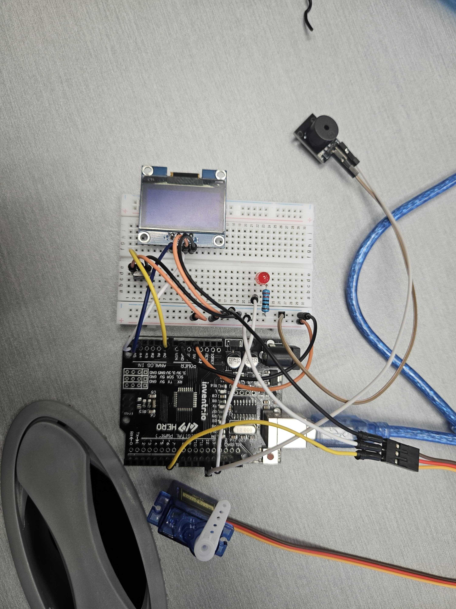
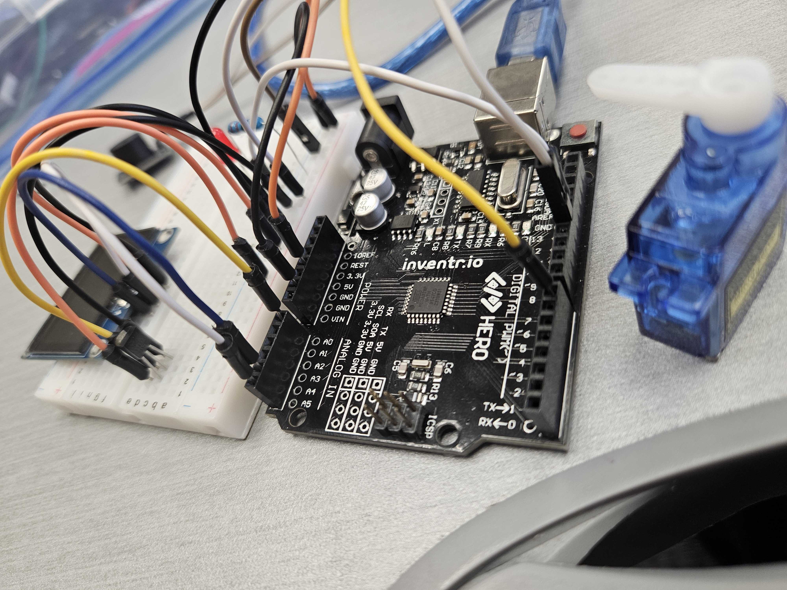
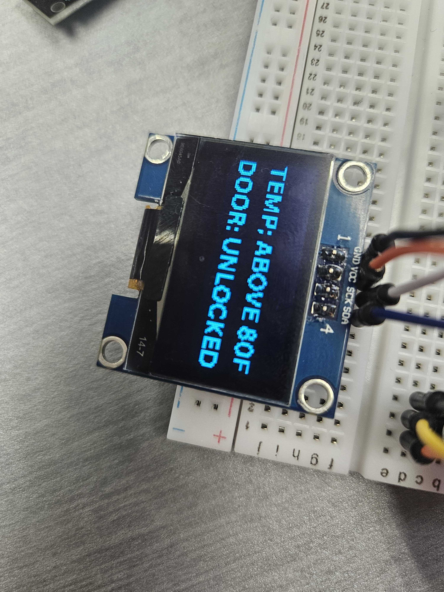
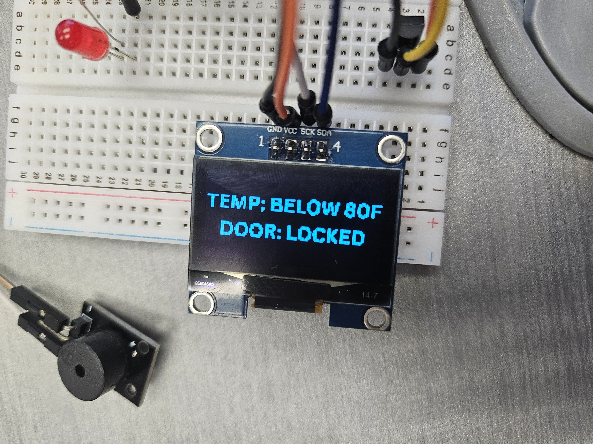
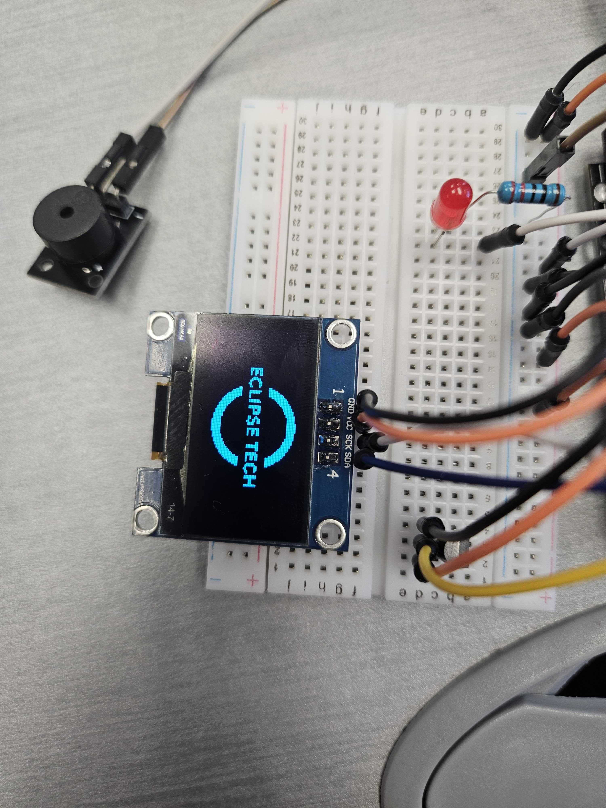

# Temperature Activated Door Lock

This project monitors temperature using a TMP36 sensor and displays it on a 128x64 OLED screen. If the temperature exceeds **80°F**, the system **activates a warning system** by flashing an LED and sounding a buzzer. Additionally, the lock mechanism (servo motor) will also react to the temperature, providing a simple automated response system. This automated response could potentially alert you to a fire and make escaping the building quicker.

---

## Components Used

| Component               | Quantity |
|------------------------|----------|
| Arduino Uno R3         | 1        |
| Breadboard             | 1        |
| Red LED                | 1        |
| 220Ω Resistor          | 1        |
| TMP36 Temperature Sensor | 1      |
| Servo Motor            | 1        |
| Jumper Wires           | 15      |
| Piezo Buzzer           | 1        |
| 128x64 OLED Display (I2C) | 1     |

---

## Installation & Setup

1. **Connect Power to the Bread Board**
        - 5V → Bread Board positive strip (+)
        - GND → Bread Board negative strip (-)

2. **Connect the TMP36 Temperature Sensor**  
   - VCC → 5V  
   - GND → GND  
   - Vout → A0

3. **Connect the 128x64 OLED Display (I2C)**  
   - VCC → 5V  
   - GND → GND  
   - SDA → A4  
   - SCL/SCK → A5

4. **Connect the LED**  
   - LED anode (+) → Digital Pin 13  
   - LED cathode (–) → 220Ω Resistor → GND

5. **Connect the Piezo Buzzer**  
   - Positive → Digital Pin 12  
   - Negative → GND

6. **Connect the Servo Motor**  
   - Signal(Yellow) → Digital Pin 7  
   - Power(Red) → 5V  
   - GND(brown or black) → GND

7. **Upload the Code**:
   - Open [Arduino IDE](https://www.arduino.cc/en/software/).
   - *Install the program if you don't already have it.*
   - Connect your Arduino Uno via USB.
   - Upload your `.ino` sketch.

---

## How It Works

- When the circuit is setting up the code, a fake company logo and name is displayed on the **OLED**.
- The **TMP36 sensor** continuously reads the temperature.
- The temperature is converted to Fahrenheit and displayed on the **OLED screen**.
- If the temperature **exceeds 80°F**, the system:
  - **Flashes the LED**
  - **Sounds the buzzer**
  - **The servo motor unlocks**
- If the temperature is **below 80°F**, the system:
  - **OLED still displays the temperature**
  - **No alert is triggered**
  - **The servo motor locks**

---

## Images / Videos

- 
- 
- 
- 
- 

---

## Simulation

> Use an online simulator like [Tinkercad](https://www.tinkercad.com/) to view or simulate the main circuit of the project.

- [Tinkercad Simulation Link](https://www.tinkercad.com/things/hERp1Jxjucs-temperature-activated-door-lock?sharecode=-_JbOfbAQsgOuH1gnYJJnzqdAzvLC9kQxNcvtE18WwI)

> Use an online simulator like [Wokwi](https://wokwi.com/) to view or simulate how the **OLED** gets connected to the project.

- [Wokwi Simulation Link](https://wokwi.com/projects/438362307963501569)

---

## Credits

- Project by: *Nat King*
- Inspired by: Fire detection systems and household smart systems.
- Libraries used:
  - `U8g2lib.h`
  - `Wire.h`
  - `Servo.h`

---
